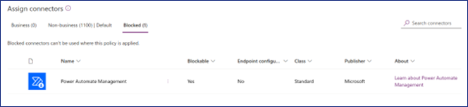
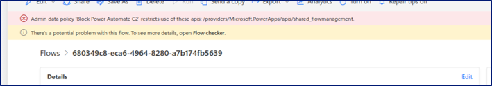

# PAC2: PowerAutomateC2


Power Automate C2 (PAC2) is a stealth living-off-the-cloud C2 framework. 

## Overview

PAC2 is a framework that generates arbitrary flows and sends and executes them on the Power Automate Platform.
It is implemented using the functionality of the Power Automate Management Connector, which is provided by default in Power Automate.

This tool is intended for use by Red Teams and aims to achieve the following two objectives:

Accurately assess the risks associated with backdoors planted on the Power Automate Platform.
Raise awareness of measures to securely use Power Automate.

## Prerequisites for PAC2

The prerequisites for operating PAC2 are as follows:

- A host machine with internet access is available.
- The user possesses authentication credentials that provide access to the Power Automate Platform.
- The following connectors are available on the accessible Power Automate Platform:
    - Power Automate Management Connector
    - Dropbox Connector or HTTP Connector (Premium)

## Features

- Living off the cloud 
    - No use of Power Automate Desktop Flow
    - No custom Power Automate connectors
- Stealth
    - No traces in the victim user's endpoint or network devices in the target corporate environments
    - Automatically delete flow logs and flow itself
- Persistence
    - The C2 connections continue even after victim users have changed their password
- Bypass security measures
    - Not detected by Endpoint solutions
    - Not blocked by network security solutions
- Flow generation
    - Handy preset flows 
    - Generates flow with Python code
    - Supports XOR encoding
- PAC2 control panel
    - Session management and easy access to exfiltrated data stored in M365

## License

PAC2 is released under the BSD-3-clause license. For more details, please refer to the LICENSE file.

> [!IMPORTANT]
> This tool was created to evaluate the security of Power Automate. As stated in the BSD-3-clause license, the developers and contributors bear no responsibility for any damages that may arise from the use of this tool.

## How to start

### Quick start with docker

Quick start with Dropbox c2 on Ubuntu host.

1. Clone repository

```
git clone https://github.com/NTT-Security-Japan/pac2.git && cd pac2
```

2. Make connectivity between the Power Automate Platform and PAC2.

(Use Dropbox for C2 connection)

Prerequisites: Dropbox account

- Mount Dropbox to the local

```
./mount/mount_dropbox.sh
```

- Access to the URL issued to link the Dropbox account. The URL is shown in the CLI below.

```
bc33cf5e3aec9519bc0f2bc115c395d3b45c88ee619ceb8e8f9fd086bfe350be
Please visit https://www.dropbox.com/cli_link_nonce?nonce=ff437fa22c998804c53d6599505264f3 to link this device.
```

- Login to Dropbox and click the link button. If the operation is successful, the following message will be shown on the CLI.

```
This computer is now linked to Dropbox.
```

(Use HTTP for C2 connection)

Prepare to expose 9999/TCP to the internet. 
Service such as [ngrok](https://ngrok.com) or [frp](https://github.com/fatedier/frp) will help you.


3. Start PAC2 server
```
docker compose up -d
```

Now, PAC2 is running on `http://localhost:9999`.

## How to Use

Please refer to the [How to Use](docs/how-to-use.md) document for detailed instructions on how to use this tool.

## Advanced Usages

For more advanced applications of this tool, refer to the [Advanced Usages](docs/advanced-usages.md) document.

## Attack Scenario for Red Team

This section appears to be a heading for further content related to attack scenarios for Red Teams, potentially discussing specific strategies or examples of how the tool can be used in simulated cybersecurity attack scenarios.

For more details, refer to [Attack Scenario](docs/attack-scenario.md).

## Measurements

As a countermeasure against PAC2, it is recommended that restrictions be implemented using the Power Automate Management Connector with DLP (Data Loss Prevention). By blocking the Power Automate Management Connector with a DLP policy, it is possible to prevent the PAC2 client from operating on Power Automate.



By restricting the use of connectors through a DLP policy, the flow of PAC2 can be rendered non-executable, as shown below.



## Concept and Design

PAC2 is composed of two main components:

- PAC2 App: This is the Power Automate C2, implemented as a Flask web application.
- [PyPowerAutomate](https://github.com/NTT-Security-Japan/PyPowerAutomate): A specialized library dedicated to generating Power Automate flows.

Please refer to the [Design Documentation](docs/design.md) for more detailed information.

## Developer Documents

For information about developers, consult the [Developer Documents](docs/development.md).

## Ethical Considerations

Please refer to the [Ethicals Documantation](docs/ethicals.md)

## Update History

- 2024/04/16: Initial release.

