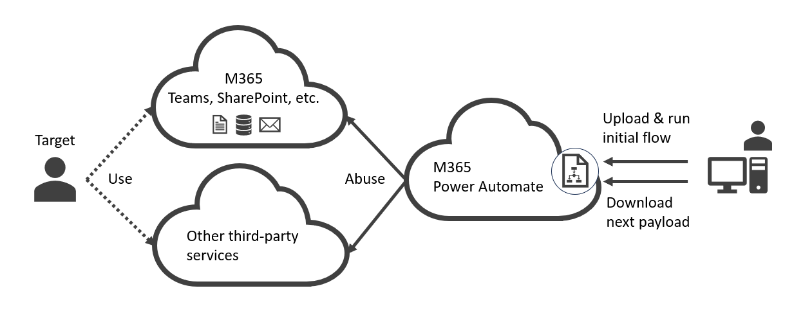

## Attack Scenario for Red Team

1. Initial Infection
    - Any impersonation and Session hijack methods
        - e.g., Steal PRT and access to a PowerAutomate page as a victim user
2. Register the Initial Payload
    - Establish C2 connection between PowerAutomate and our C2 server
        - Import a primary payload as a zip file generated by our tool
3. Execute Secondary Payload
    - Attackers generate arbitrary payloads by our tool and put them to the C2 server
    - PowerAutomate downloads the secondary payloads from the C2 server via HTTPS(S)
    - PowerAutomate uploads output executed by the secondary payloads
    - Attackers maintain the secondary payloads in the C2 server anytime and continue their stealth activities
