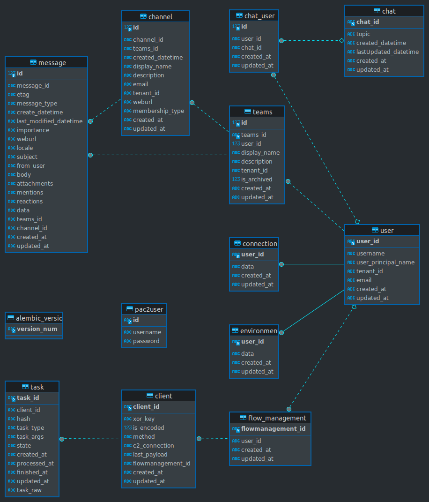

# 5. Developer Documentation

This section of the documentation is dedicated to developers. It covers the folder structure, ServerSide API, and database schema, providing essential information for understanding and working with PAC2

## 5.1 Folder Structure

TBU

## 5.2 ServerSide API

TBU

## 5.3 Database Schema

